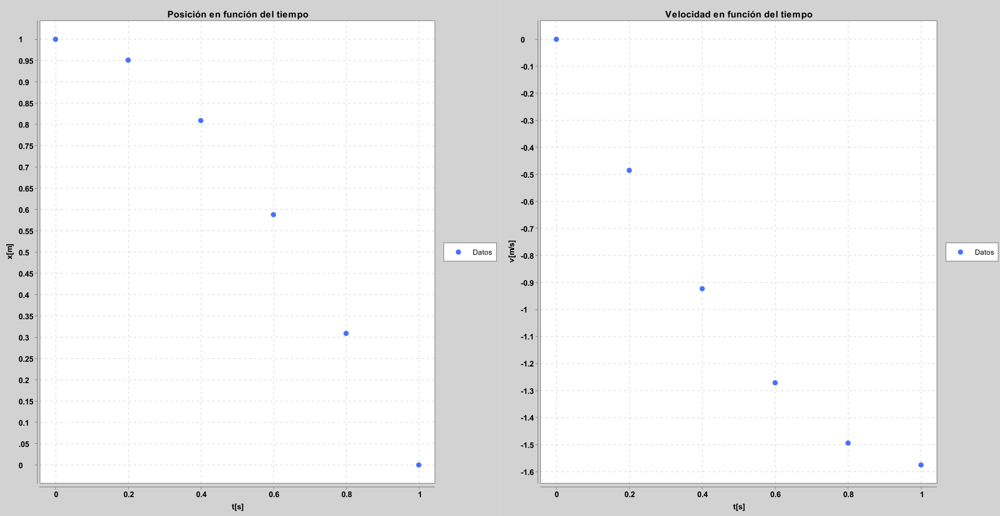
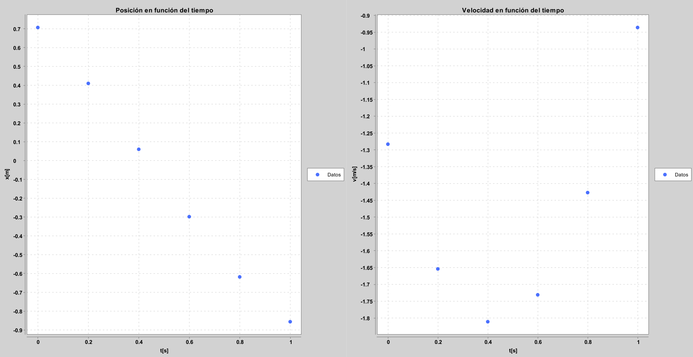
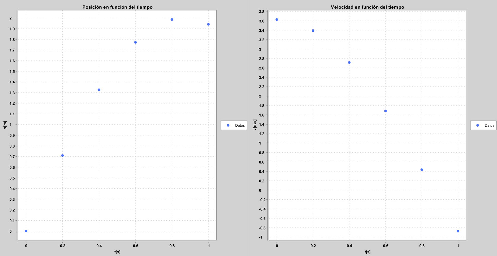
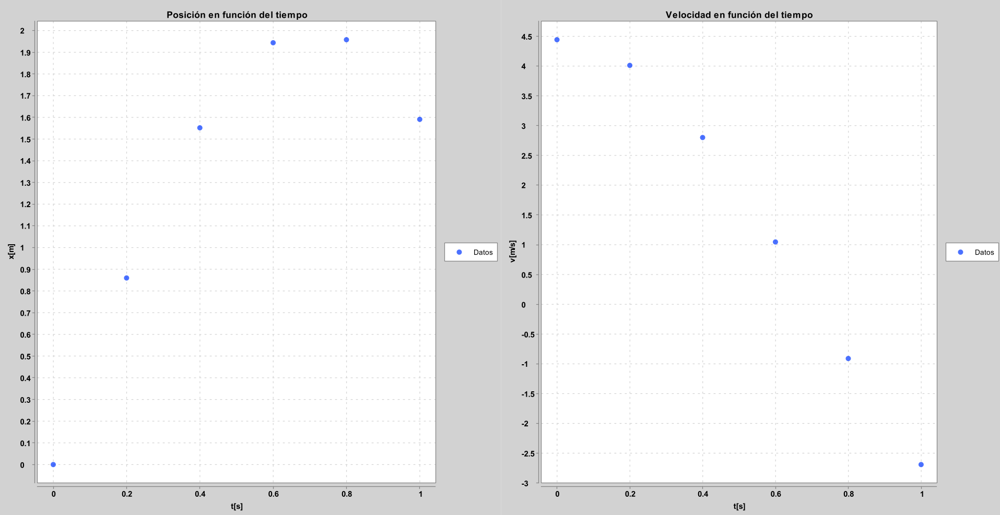
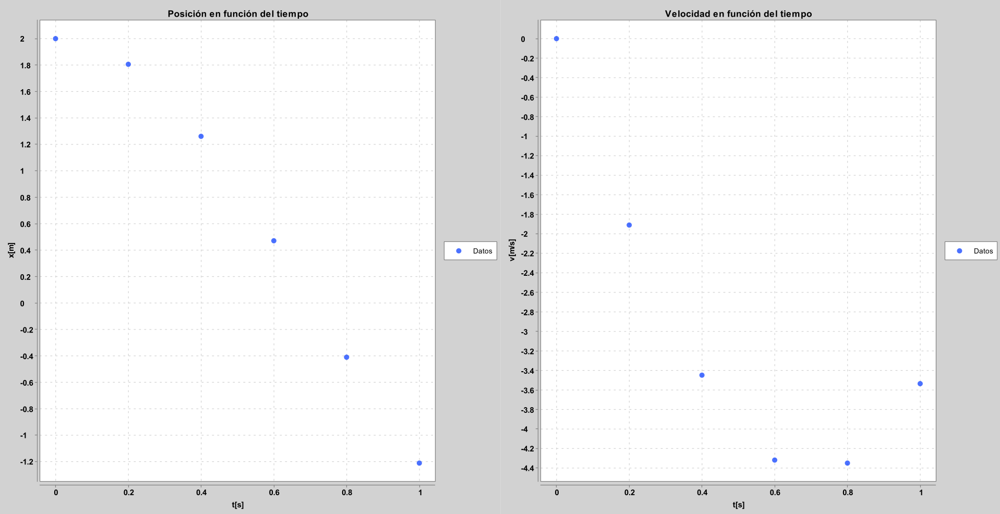
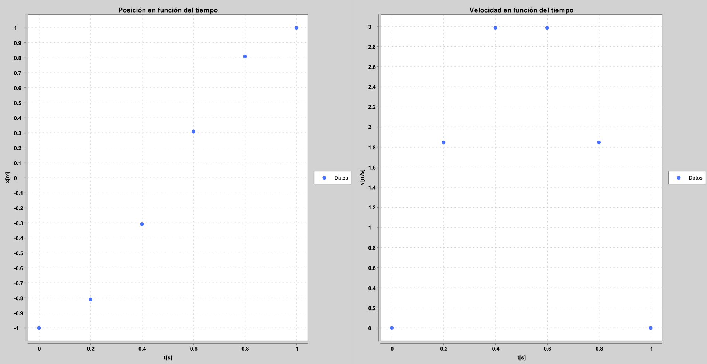

# **PROYECTO LABORATORIO FISICA - MOVIMIENTO ARMÓNICO SIMPLE**
*Nombre: Miguel Mateo Arcani Alvarez* \
*Grupo: D6*
# **DATOS:**
### Tabla 1: Partícula con masa \(4m\)

| t [s] | x [m] | v [m/s] |
|-------|-------|---------|
| 0.000 | 1.000 | 0.000 |
| 0.200 | 0.951 | -0.485 |
| 0.400 | 0.809 | -0.923 |
| 0.600 | 0.598 | -1.271 |
| 0.800 | 0.309 | -1.494 |
| 1.000 | 0.000 | -1.571 |

---

### Tabla 2: Partícula con masa \(3m\)

| t [s] | x [m] | v [m/s] |
|-------|-------|---------|
| 0.000 | 0.707 | -1.283 |
| 0.200 | 0.410 | -1.654 |
| 0.400 | 0.060 | -1.811 |
| 0.600 | -0.298 | -1.731 |
| 0.800 | -0.618 | -1.427 |
| 1.000 | -0.856 | -0.936 |

---

### Tabla 3: Partícula con masa \(3m\)

| t [s] | x [m] | v [m/s] |
|-------|-------|---------|
| 0.000 | 0.700 | 3.628 |
| 0.200 | 1.070 | 3.392 |
| 0.400 | 1.327 | 2.714 |
| 0.600 | 1.772 | 1.683 |
| 0.800 | 1.944 | 0.453 |
| 1.000 | 1.941 | -0.873 |

---

### Tabla 4: Partícula con masa \(2m\)

| t [s] | x [m] | v [m/s] |
|-------|-------|---------|
| 0.000 | 0.000 | 4.443 |
| 0.200 | 0.860 | 4.012 |
| 0.400 | 1.552 | 2.801 |
| 0.600 | 1.980 | 1.307 |
| 0.800 | 1.958 | -0.910 |
| 1.000 | 1.591 | -2.691 |

---

### Tabla 5: Partícula con masa \(2m\)

| t [s] | x [m] | v [m/s] |
|-------|-------|---------|
| 0.000 | 2.000 | 0.000 |
| 0.200 | 1.866 | -1.913 |
| 0.400 | 1.261 | -3.448 |
| 0.600 | 0.480 | -4.349 |
| 0.800 | -0.410 | -4.349 |
| 1.000 | -1.211 | -3.535 |

---

### Tabla 6: Partícula con masa \(m\)

| t [s] | x [m] | v [m/s] |
|-------|-------|---------|
| 0.000 | -1.000 | 0.000 |
| 0.200 | -0.809 | 1.913 |
| 0.400 | -0.309 | 2.988 |
| 0.600 | 0.309 | 2.988 |
| 0.800 | 0.809 | 1.847 |
| 1.000 | 1.000 | 0.000 |

---

# **TEORIA**

El **Movimiento Armónico Simple (MAS)** es un tipo de movimiento **periódico y oscilatorio** en el cual una partícula se mueve a lo largo de una trayectoria **en torno a una posición de equilibrio**, bajo una **fuerza restauradora proporcional al desplazamiento**.

---

##  **Definición general**

Un cuerpo realiza un **Movimiento Armónico Simple** si su **aceleración es directamente proporcional al desplazamiento** y **opuesta en dirección**:

$$
a = -\omega^2 x
$$

donde:

- \( a \): aceleración del cuerpo (m/s²)  
- \( x \): desplazamiento desde la posición de equilibrio (m)  
- \( w ): **frecuencia angular** (rad/s)

---

##  Ecuaciones fundamentales del MAS

### 🔹 Posición en función del tiempo:

$$
x(t) = A \cos(\omega t + \phi)
$$

o también:

$$
x(t) = A \sin(\omega t + \phi)
$$

donde:

- \( A \): amplitud (máximo desplazamiento desde el equilibrio)  
- \( w): frecuencia angular (rad/s)  
- \( t \): tiempo (s)  
- \( phi ): fase inicial (rad)

---

### 🔹 Velocidad:

$$
v(t) = \frac{dx}{dt} = -A \omega \sin(\omega t + \phi)
$$

o equivalentemente (si se usa seno en la posición):

$$
v(t) = A \omega \cos(\omega t + \phi)
$$

---

### 🔹 Aceleración:

$$
a(t) = \frac{d^2x}{dt^2} = -A \omega^2 \cos(\omega t + \phi)
$$

Por tanto:

$$
a = -\omega^2 x
$$

Esto demuestra que la aceleración siempre apunta hacia el punto de equilibrio.

---

##  Magnitudes características

| Magnitud | Símbolo | Fórmula | Unidad (SI) | Significado |
|-----------|----------|----------|--------------|--------------|
| Amplitud | \( A \) | — | m | Máximo desplazamiento |
| Frecuencia angular | \(w) | \( w = 2*pi f =2pi /T) | rad/s | Rapidez de la oscilación |
| Período | \( T \) | \( T = 2pi/w ) | s | Tiempo de una oscilación completa |
| Frecuencia | \( f \) | \( f =1/T ) | Hz | Oscilaciones por segundo |

---

##  **Relación entre posición, velocidad y aceleración**

$$
v^2 = \omega^2 (A^2 - x^2)
$$

$$
a = -\omega^2 x
$$

Estas relaciones permiten describir el movimiento sin necesidad del tiempo.

---

##   **Energía en el MAS**

El movimiento armónico simple **conserva energía**, es decir, la **energía total permanece constante**.

### 🔹 Energía cinética:

$$
E_k = \frac{1}{2} m v^2 = \frac{1}{2} m \omega^2 (A^2 - x^2)
$$

### 🔹 Energía potencial elástica:

$$
E_p = \frac{1}{2} k x^2
$$

con \( k = m \omega^2 \)

### 🔹 Energía mecánica total:

$$
E = E_k + E_p = \frac{1}{2} k A^2 = \text{cte.}
$$

---

##   Ejemplo clásico: masa-resorte

Cuando un cuerpo de masa \( m \) está unido a un resorte con constante elástica \( k \), el movimiento cumple la **Ley de Hooke**:

$$
F = -k x
$$

Combinando con la segunda ley de Newton:

$$
F = m a \Rightarrow m a = -k x \Rightarrow a = -\frac{k}{m} x
$$

Por comparación con la ecuación general \( a = -\omega^2 x \):

$$
\boxed{\omega = \sqrt{\frac{k}{m}}}
$$

---

##   Representaciones gráficas

1. **Posición vs. tiempo** → onda sinusoidal  
2. **Velocidad vs. tiempo** → onda desfasada 90°  
3. **Aceleración vs. tiempo** → onda desfasada 180°  
4. **Energías** → intercambio periódico entre \( E_k \) y \( E_p \)

---

# **RESULTADOS**

### Tabla 1: Partícula con masa \(4m\)

En esta tabla se nota que la posición (x) va disminuyendo poco a poco desde 1 m hasta llegar a 0 m, mientras que la velocidad (v) pasa de 0 a valores negativos. Esto muestra que la partícula empieza en el punto máximo y se mueve hacia el equilibrio, aumentando su rapidez al principio y luego reduciéndose, lo que encaja con un movimiento oscilatorio típico de un sistema con mucha masa.

---

### Tabla 2: Partícula con masa \(3m\)

Aquí se observa que la partícula inicia con una posición positiva, pero esta se va haciendo negativa con el tiempo. La velocidad también empieza negativa y cambia su valor, lo cual indica que la partícula se está moviendo hacia el otro lado del equilibrio. El cambio en los valores es más notorio que en la de 4m, lo que sugiere un movimiento más rápido y con menor periodo.

---

### Tabla 3: Partícula con masa \(3m\)

En este caso, la posición aumenta desde cero hasta un valor máximo, y luego empieza a bajar un poco. La velocidad, en cambio, comienza positiva y se va haciendo negativa al final. Esto representa una oscilación completa: primero avanza hasta el extremo y después regresa. El comportamiento sigue el patrón de un movimiento armónico donde la velocidad y la posición están fuera de fase.

---

### Tabla 4: Partícula con masa \(2m\)

Los datos muestran que la posición crece rápidamente al principio y luego disminuye, mientras que la velocidad pasa de valores positivos altos a negativos. Esto quiere decir que la partícula empieza acelerando hacia un lado y luego frena para volver al punto de equilibrio. El movimiento es más rápido que en los casos con mayor masa, mostrando que a menor masa, mayor frecuencia.

---

### Tabla 5: Partícula con masa \(2m\)

Aquí se ve que la partícula inicia con una posición alta y que rápidamente se mueve hacia valores negativos. La velocidad también empieza en cero y se hace muy negativa, lo que significa que la partícula se desplaza velozmente hacia el otro extremo. Esto coincide con un movimiento más ágil, propio de una masa menor que oscila con mayor rapidez.

### Tabla 6: Partícula con masa \(m\)

En esta última tabla, la partícula parte desde una posición negativa y va aumentando hasta llegar a una positiva. La velocidad sigue el mismo patrón pero con signo opuesto, confirmando que cuando la posición es máxima, la velocidad es cero y viceversa. Este comportamiento muestra un movimiento armónico claro, donde la oscilación es rápida y con gran amplitud, ya que la masa es la menor de todas.

# **OBSERVACIONES EXTRAS**
